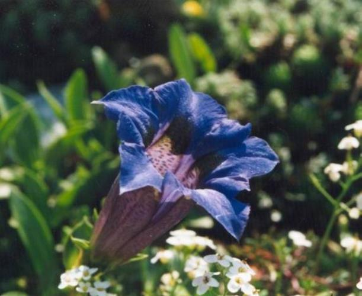

#### Notebook Image Classifier

This notebook contains my implementation for the image classifier project from [Udacity's Data Science Nanodegree](https://www.udacity.com/school-of-data-science).

The goal of the project was to train an image classifier to recognize different species of flowers. We'll be using the [following dataset](http://www.robots.ox.ac.uk/~vgg/data/flowers/102/index.html) containing 102 flower categories. Here is an example of the training data:

The project is broken down into multiple steps:

* Load and preprocess the image dataset
* Train the image classifier on your dataset
* Use the trained classifier to predict image content

Here your network will be learning about flowers and end up as a command line application, but this procedure can be extended to any other image data set. At the end of this project, we'll have an application that can be trained on any set of labeled images.

If you run this notebook, please make sure that you are using a **GPU**.